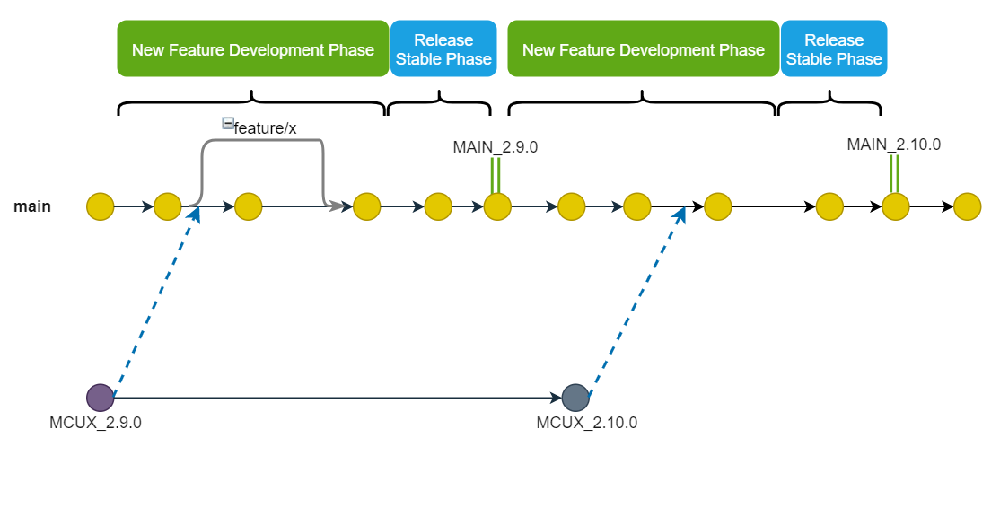

# MCUXpresso SDK: mcux-sdk
MCUXpresso SDK is a comprehensive software enablement package designed to simplify and accelerate application development with Arm® Cortex®-M-based devices from NXP, including its general purpose, crossover and Bluetooth™-enabled MCUs. This project provides an alternative way for user to achieve the source code of MCUXpresso SDK besides SDK builder and MCUXpresso IDE.

The whole MCUXpresso SDK delivery is composed of separate project deliveries. The idea we split the whole SDK delivery to separate projects is inspired by [Zephyr](https://github.com/zephyrproject-rtos/zephyr), and the projects are planned as below:
* Fundamental project for device/board enablement with shared drivers and components.
* RTOS projects
* Middleware projects
* Examples project built on above deliveries

In this way we want to benefit user from below aspects:
1. Provide ability for user to select needed projects to build his application.
2. Avoid huge size in a single repository.

To satisfy the expectation we leveraged [Zephyr west tool](https://docs.zephyrproject.org/latest/guides/west/index.html) which helps do multi-repository management and allow user to self create ```west.yml``` to select needed projects for downstream use. 

## Overview
This project provides the fundamental support for all NXP hot parts:

* Arm® CMSIS-CORE startup and device header files and CMSIS-DSP standard libraries
* Open-source peripheral drivers that provide stateless, high-performance, easy-to-use APIs
* Drivers for communication peripherals also include high-level transactional APIs for high-performance data transfers 
* High-quality software: all drivers and startup code are MISRA-C: 2012 compliant and checked with Coverity® static analysis tools

**The project can work solely**, if you only want to get the fundamental support for SoC(s) or board(s), you just use the original Git way to clone and checkout the project.

**The project is also the main repository to achieve the whole SDK delivery**, it contains the [west.yml](https://github.com/NXPmicro/mcux-sdk/blob/main/west.yml) which keeps description and revision for other projects in the overall MCUXpresso delivery. You need to have both Git and West installed, then execute below commands to achieve the whole SDK delivery at revision ```${revision}``` and place it in a folder named ```mcuxsdk```.
```
west init -m https://github.com/NXPmicro/mcux-sdk --mr ${revision} mcuxsdk
cd mcuxsdk
west update
```
Replace ```${revision}``` with any SDK revision you wish to achieve. This can be ```main``` if you want the latest state, or any commit SHA. 

## Releases

There are two types of release in the project. The MCUXpresso SDK release and GitHub Main SDK release. Below description uses **MCUX release** short for MCUXpresso SDK release, use **Main release** short for GitHub Main SDK release.

### MCUX Release
The MCUX release launches once a new release is available on [SDK Builder](http://mcuxpresso.nxp.com/). Users previously using [SDK Builder](http://mcuxpresso.nxp.com/) could easily find the exact same code base MCUX release with same 2.x.y version of SDK archive package, software examples build/run quality are guaranteed in the release. **MCUX releases will be prefixed with 'MCUX_'**, and every release will be merged into main branch to ensure main branch has all released boards/socs support. 

The "MCUX_" releases are categorized into mainline releases and NPI release.
* For mainline releases, usually it's planned twice a year to do a global feature update for NXP hot parts. The x in 2.x.y version increments each time a mainline release goes out. 
* For NPI release, it aims to support a new soc product recently launched in the market. It is built with verified features in previous mainline release. The release name is suffixed with NPI name to identify it's an NPI release.

Each MCUX release is made on previous mainline release tag/NPI release tag, thus user could easily check the difference between two releases using ````git diff```` command.

### Main Release
The Main release is a regular release made in main branch. It releases the latest code base and feature set on main branch, which is expected to include all the previous 'MCUX_' release content and new enablement on main branch for NXP hot parts. **Main releases will be prefixed with 'MAIN_'**.

Below figure takes 2.9.0 and 2.10.0 release as an example to show the relationship between MCUX release and Main release.


## Supported development tools and systems
* Tools
    * MCUXpresso IDE
    * GCC ARM Embedded

    For version of the tool used, please check the release notes in each release.
* Systems

    See [Supported development systems](docs/supported_development_systems.md) for the list of boards/socs currently support in this project.

## Getting Started
See [Getting Start Guide](docs/Getting_Started.md) to start explore the project.

## License
All SDK drivers, components, device support files, board support files and driver examples in this project are under BSD-3-Clause license, license copy please check [COPYING_BSD-3](COPYING-BSD-3). The ARM CMSIS component is under Apache License 2.0, license copy check [Apache License 2.0](CMSIS/LICENSE.txt). License information for all components could be found in [SW-Content-Register.txt](SW-Content-Register.txt)

## Contribution
Contributions are greatly welcomed! For detail guideline of contribution please check [Contribution Guide](CONTRIBUTING.md).

