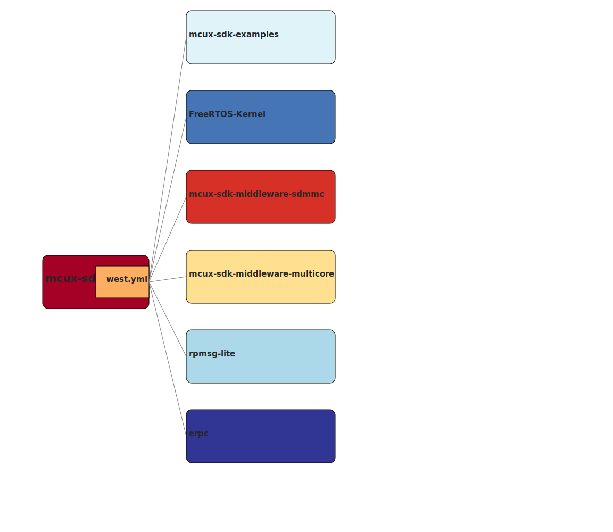

# Overview

MCUXpresso SDK is a comprehensive software enablement package designed to simplify and accelerate application development with Arm® Cortex®-M-based devices from NXP, including its general purpose, crossover and Bluetooth™-enabled MCUs. 

Previously user should get MCUXpresso SDK via mcuxpresso.nxp.com or MCUXpresso IDE. Now NXP MCUXpresso SDK project provides a new way for user to achieve this. You could find all NXP hot parts in this project and get below features:

* Arm® CMSIS-CORE startup and device header files and CMSIS-DSP standard libraries
* Open-source peripheral drivers that provide stateless, high-performance, easy-to-use APIs
* Drivers for communication peripherals also include high-level transactional APIs for high-performance data transfers 
* High-quality software: all drivers and startup code are MISRA-C: 2012 compliant and checked with Coverity® static analysis tools

**The project can work solely**, if you only want to get the fundamental support for SoC(s) or board(s), you just use the original Git way to clone and checkout the project.

**The project is also the main repository to achieve the whole SDK delivery**, it contains the [west.yml](https://github.com/NXPmicro/mcux-sdk/blob/main/west.yml) which keeps description and revision for other projects in the overall MCUXpresso delivery. Currently available middleware sets are shown in below figure, user could click the middleware to navigate the middleware project repo.
[](https://htmlpreview.github.io/?https://github.com/NXPmicro/mcux-sdk/blob/main/docs/sdk_graph.html)
You need to have both Git and West installed in order to get a new delivery of the whole SDK or update the existing SDK deliveries. You could follow below guide according to your scenario:
* Clone/check-out a new delivery of whole SDK
    
    Execute below commands to achieve the whole SDK delivery at revision ```${revision}``` and place it in a folder named ```mcuxsdk```
    ```
    west init -m https://github.com/NXPmicro/mcux-sdk --mr ${revision} mcuxsdk
    cd mcuxsdk
    west update
    ```
    Replace ```${revision}``` with any SDK revision(branch/tag/commit SHA) you wish to achieve. This can be ```main``` if you want the latest state, or any commit SHA or tag. 

* Update existing west cloned SDK whole delivery
    
    Assume you have followed previous commands to clone/check-out whole SDK delivery to the west workspace mcuxsdk, then the main repository of SDK is located in mcuxsdk/core. If you would like to update/check-out to another revision, you need to first update the main repository to the expected revision, then update the west workspace:
    
    When you would like to update SDK full delivery in the latest branch of main repository, follow below commands:

     ```
    cd mcuxsdk/core
    git fetch
    git rebase
    west update
    ```

    If the ```${revision}``` is different revision from that used in main repository, such as different branch, different tag or different commit SHA, you could follow below commands:
    ```
    cd mcuxsdk/core
    git fetch
    git checkout ${revision}
    west update
    ```
Other features like RTOS support and middleware stacks currently are not demonstrated in this project. If you are interest in these features please go mcuxpresso.nxp.com to find full SDK support.

# Releases

There are two types of release in the project. The MCUXpresso SDK release and GitHub SDK release. 

The MCUXpresso SDK release launches once a new release is available on [SDK Builder](http://mcuxpresso.nxp.com/). In each release, you could find same code base for boards/socs with same version SDK archive you've got from [SDK Builder](http://mcuxpresso.nxp.com/), software examples build/run quality are guaranteed. Releases will be prefixed with 'MCUX_'.

The GitHub SDK release is a regular release take place in every six months. It releases the latest code base and feature set for SDK on all NXP hot parts. Releases will be prefixed with 'GITHUB_'.

Below figure takes 2.9.0 and 2.10.0 release as an example to show the relationship between MCUXpresso Release and GitHUB release.

# Supported boards and socs
See [Supported development systems](docs/supported_development_systems.md) for the list of boards/socs support in this project.

# Getting Started
See [Getting Start Guide](docs/Getting_Started.md) to start explore the project.

# License
Most of software in the project is open-source and licensed under BSD-3-Clause, see [COPYING_BSD-3](COPYING-BSD-3). Whole license information for the project could be found in [SW-Content-Register.txt](SW-Content-Register.txt)

# Contribution
Currently we are not ready to accept contribution, you could create an issue to suggest a new idea or track a bug. Contribution will be open soon.
