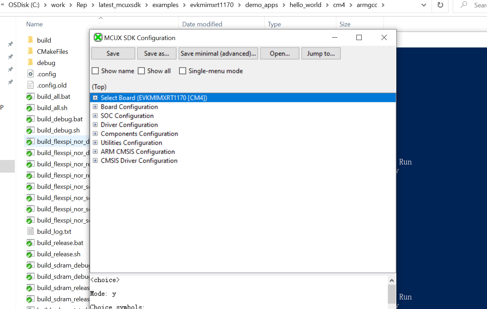

From SDK 2.14.0 release, the cmake modules provided for SDK drivers/components/middleware no longer handle the component dependencies, which means including a cmake module will not recursively include the required cmake modules. For example, include(driver_lpuart) will no longer include the required cmake modules such as include(driver_common), include(driver_clock)..etc. Users need to add all required cmake modules explicitly.

To ease the process of building SDK and integrate needed cmake modules into their project, a experiemental version of kconfig is implemented in our project.

# Kconfig system
Please check the [SDK Kconfig](mcux_kconfig.md) for more details.

# How SDK examples integrate Kconfig
This part we referenced work from zephyr project [Zephyr](https://github.com/zephyrproject-rtos/zephyr). 
 - python version kconfiglib located in [kconfig-scripts](https://github.com/nxp-mcuxpresso/mcux-sdk/tree/MCUX_2.14.0/scripts) to do the configuration.
 - cmake modules located in [cmake-kconfig](https://github.com/nxp-mcuxpresso/mcux-sdk/tree/MCUX_2.14.0/cmake) to invoke the kconfig to configure/re-configure your project in cmake build.

An example integration please see [hello-world](https://github.com/nxp-mcuxpresso/mcux-sdk-examples/blob/MCUX_2.14.0/evkbmimxrt1170/demo_apps/hello_world/cm4/armgcc/CMakeLists.txt), you should be able to see a .config file generated after you build the project. You could then run ```mingw32w-make guiconfig``` or ```mingw32w-make menuconfig```to reconfigure the project.

Below shows the guiconfig window popped out after running ```mingw32w-make guiconfig``` under the armgcc folder.
