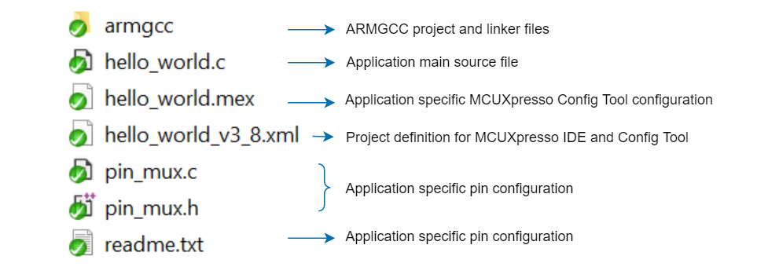

# Getting Start with MCUXpresso SDK
This section helps you build basic understanding of current fundamental project content and guide you how to build and run the provided example project in whole SDK delivery.

## Fundamental Project(core)
The fundamental project, alias the core project in west workspace which places in the folder `core`. The core project focus on the delivery of device support, board support, shared peripheral drivers and components. 

| Folder | Description |
| :--------- | :-------- |
| boards | Board support package. For each board, there are board configuration files. |
| CMSIS | ARM CMSIS core files. |
| cmsis_drivers | ARM CMSIS driver NXP peripheral implementations. |
| components | Software components. |
| devices | Device support package. For each device, header file, feature file, startup file and linker files are provided, also device specific drivers are included. |
| docs | Documentation. |
| drivers | Peripheral drivers. |
| middleware | Middleware components used in software examples. |
| tools | Software tools. |
| utilities | Software utilities. |

## Examples Project

The examples project part of the whole SDK delivery, and locates in the folder `examples` of west workspace.

In the folder `examples`, all board examples in current SDK revision are included, so it consists of several sub-folders with {board_name}. Each {board_name} folder in the directory contains a comprehensive set of examples that are relevant to that specific piece of hardware. These examples include (but are not limited to):

* demo_apps: Basic demo set to start using SDK, including hello_world and led_blinky.
* driver_examples: Simple applications that show how to use the peripheral drivers for a single use case. These applications typically only use a single peripheral but there are cases where multiple peripherals are used (for example, SPI transfer using DMA).

### Software example structure

Below we use the hello_world example (part of the demo_apps folder) to demonstrate the example structure, other examples have similar structure.

### Build and run example application
To build and run the example application, we provide below guides:

Using MCUXpresso IDE: Check steps in [Run a project using MCUXpresso IDE](run_a_project_using_mcux.md)

Using ARMGCC: Check steps in [Run a project using ARMGCC](run_a_project_using_armgcc.md)
