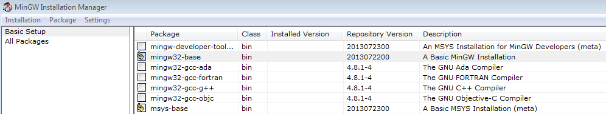
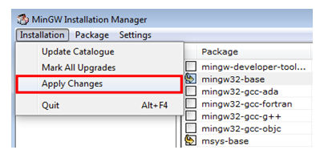
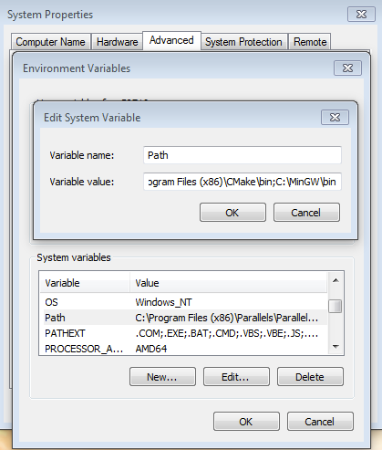
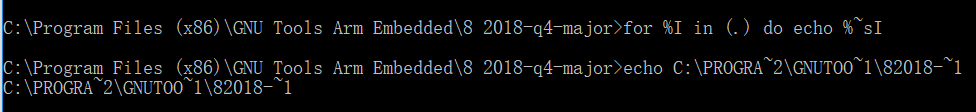
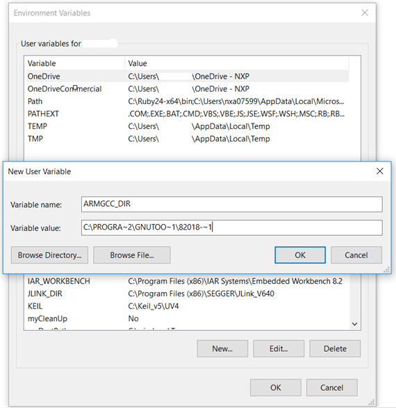
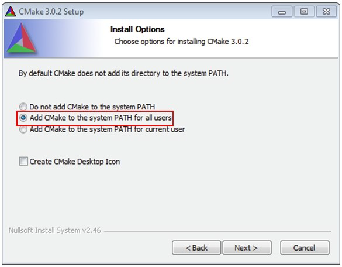
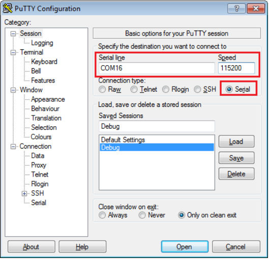
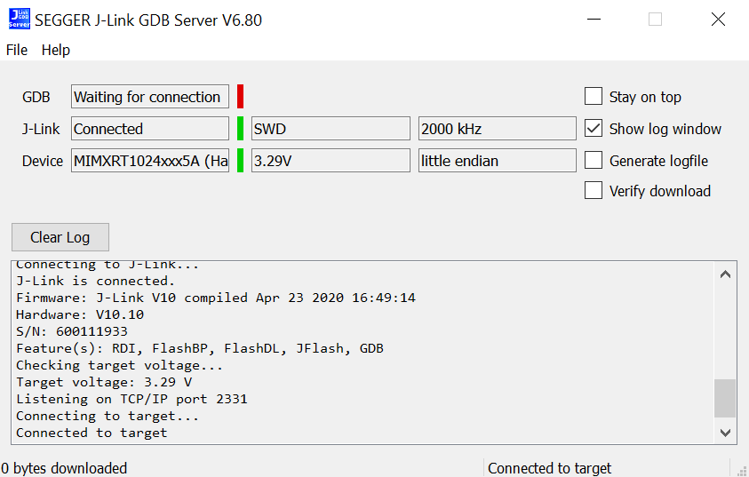
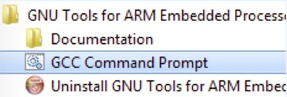
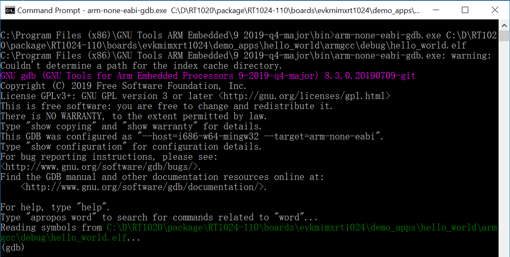

This section describes the steps to configure the command line Arm® GCC tools to build, run, and debug software examples provided in the MCUXpresso SDK. The hello_world demo located in boards/{board_name}/demos_apps/hello_world/ is used as an example.

# :one:Set up environment
This section contains the steps to install the necessary components required to build and run an MCUXpresso SDK demo
application with the Arm GCC toolchain, as supported by the MCUXpresso SDK. There are many ways to use Arm GCC
tools, but this example focuses on a Windows operating system environment.

## 1. Install GCC ARM Embedded toolchain
Download and run the installer from launchpad.net/gcc-arm-embedded. This is the actual toolset (in other words,compiler, linker, etc.).

## 2. Install MinGW (only required on Windows OS)
The Minimalist GNU for Windows (MinGW) development tools provide a set of tools that are not dependent on third-party
C-Runtime DLLs (such as Cygwin). The build environment used by the MCUXpresso SDK does not use the MinGW build
tools, but does leverage the base install of both MinGW and MSYS. MSYS provides a basic shell with a Unix-like interface
and tools.
1. Download the latest MinGW mingw-get-setup installer from sourceforge.net/projects/mingw/files/Installer/.
2. Run the installer. The recommended installation path is C:\MinGW, however, you may install to any location. But please notice that the installation path cannot contain any spaces.
3. Ensure that the **mingw32-base** and **msys-base** are selected under **Basic Setup**.

    

4. In the **Installation** menu, click **Apply Changes** and follow the remaining instructions to complete the installation.

    

5. Add the appropriate item to the Windows operating system path environment variable. It can be found under **Control
Panel->System and Security->System->Advanced System Settings** in the **Environment Variables...** section. The
path is:

   <mingw_install_dir>\bin

   Assuming the default installation path, C:\MinGW, an example is shown below. If the path is not set correctly, the toolchain will not not work.

    | :exclamation: NOTE | 
    |:-----------------------------------------:| 
    | If you have  C:\MinGW\msys\x.x\bin in your PATH variable (as required by Kinetis SDK 1.0.0), remove it to ensure that the new GCC build system works correctly.|

    

## 3. Add a new system environment variable for **ARMGCC_DIR**
Create a new system environment variable and name it as ARMGCC_DIR. The value of this variable should point to the Arm
GCC Embedded tool chain installation path. For this example, the path is:

C:\Program Files (x86)\GNU Tools ARM Embedded\8 2018-q4-major

See the installation folder of the GNU Arm GCC Embedded tools for the exact path name of your installation.
    
**Short path should be used for path setting**, you could convert the path to short path by running command "for %I in (.) do echo %~sI" in above path





## 4. Install CMake
1.  Download CMake 3.0.x from www.cmake.org/cmake/resources/software.html.
2. Install CMake, ensuring that the option **Add CMake to system PATH** is selected when installing. The user chooses to
select whether it is installed into the PATH for all users or just the current user. In this example, it is installed for all users.



3. Follow the remaining instructions of the installer.
4. You may need to reboot your system for the PATH changes to take effect.
5. Make sure sh.exe is not in the Environment Variable PATH. This is a limitation of mingw32-make.

# :two:Build an example application

- Navigate to boards/{board_name}/demos_apps/hello_world/armgcc folder
- Run the build_TARGET.sh/bat

# :three:Run an example application
This section describes steps to run a demo application using J-Link GDB Server application. To perform this exercise, make
sure that either:
- The OpenSDA interface on your board is programmed with the J-Link OpenSDA firmware. If your board does not
support OpenSDA, then a standalone J-Link pod is required.
- You have a standalone J-Link pod that is connected to the debug interface of your board.

| :exclamation: NOTE | 
|:-----------------------------------------:| 
| Some hardware platforms require hardware modification in order to function correctly with an external debug interface.|

After the J-Link interface is configured and connected, follow these steps to download and run the demo applications:
1. This board supports the J-Link debug probe. Before using it, install SEGGER software, which can be downloaded from
http://www.segger.com.
2. Connect the development platform to your PC via USB cable between the OpenSDA USB connector and the PC USB
connector. If using a standalone J-Link debug pod, also connect it to the SWD/JTAG connector of the board.
3. Open the terminal application on the PC, such as PuTTY or TeraTerm, and connect to the debug serial port number (to
determine the COM port number, see Appendix A). Configure the terminal with these settings:
    - 115200 or 9600 baud rate, depending on your board (reference BOARD_DEBUG_UART_BAUDRATE variable in the
    board.h file)
    - No parity
    - 8 data bits
    - 1 stop bit

    

4. Open the J-Link GDB Server application. Go to the SEGGER install folder. For example, C:\Program
Files(x86)\SEGGER\JLink_Vxxx. 
    - Open the command window. 
    - For Debug and Release targets, run command
    ``` JLinkGDBServer.exe``` 
    - For the sdram_debug, sdram_release, flexspi_nor_sdram_debug, and flexspi_nor_sdram_release targets, run command
    ```JLinkGDBServer.exe -scriptfile <install_dir>/boards/{board_name}/demo_apps/hello_world/{board_name}_sdram_init.jlinkscript```.
5. Select target device for the board. Take evkmimxrt1024 as an example, choose device MIMXRT1024xxx5A.
6. After it is connected, the screen should resemble this figure:

    

7. If not already running, open a GCC ARM Embedded tool chain command window. To launch the window, from the
Windows operating system **Start menu**, go to **Programs -> GNU Tools ARM Embedded <version>** and select **GCC
Command Prompt**.

    

8. Change to the directory that contains the example application output. The output can be found in below path:
    *{repo_path}/boards/{board_name}/{example_type}/{application_name}/armgcc/{build_target}*

    For this example, the path is:
    *{repo_path}/boards/evkmimxrt1024/demo_apps/hello_world/armgcc/debug*
9. Run the arm-none-eabi-gdb.exe {application_path}/{application_name}.elf. For this example, it is ```arm-none-eabi-gdb.exe {repo_path}/boards/evkmimxrt1024/demo_apps/hello_world/armgcc/debug/hello_world.elf```.

    

10. Run these commands:
    ```
    target remote localhost:2331
    monitor reset
    monitor halt
    load
    ```
11. The application is now downloaded and halted at the reset vector. Execute the monitor go command to start the demo
application.

| :zap: Check results |
|:--------------------:|
|The hello_world application is now running and a banner is displayed on the terminal. If this is not true, check your terminal settings and connections.|