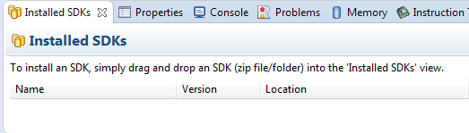
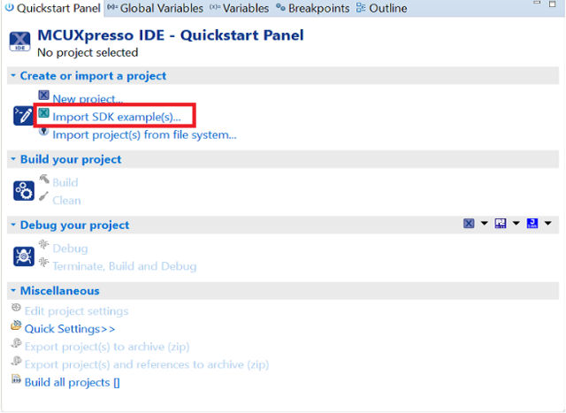
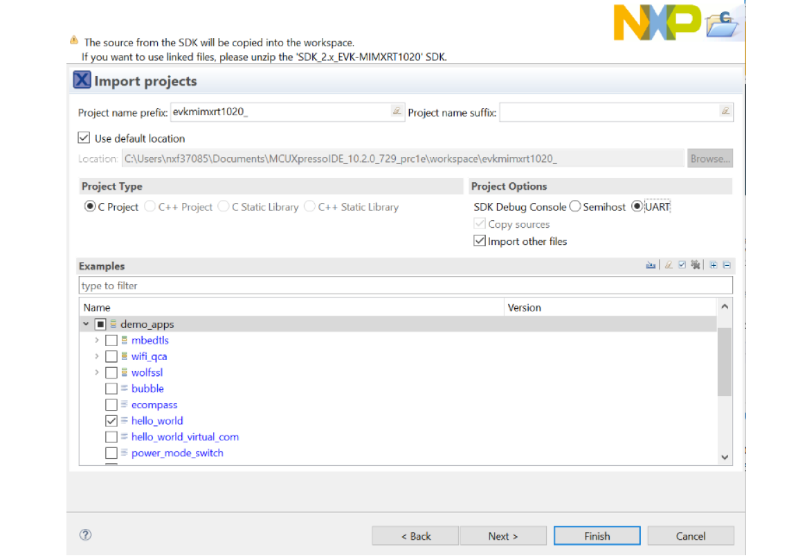
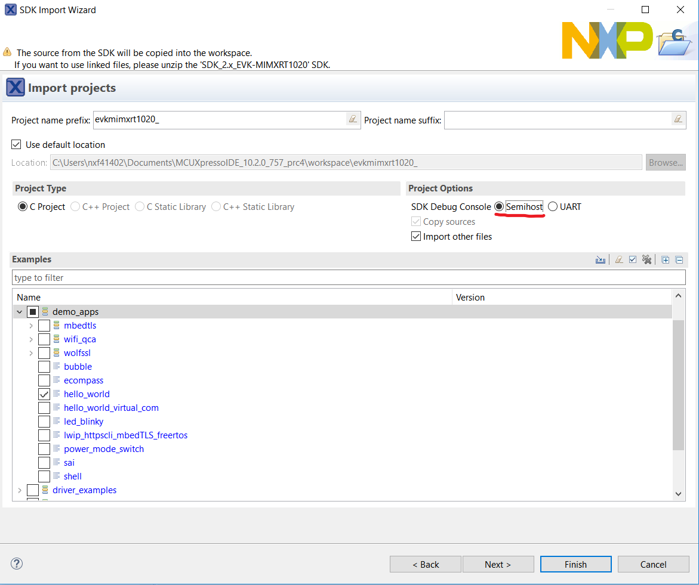
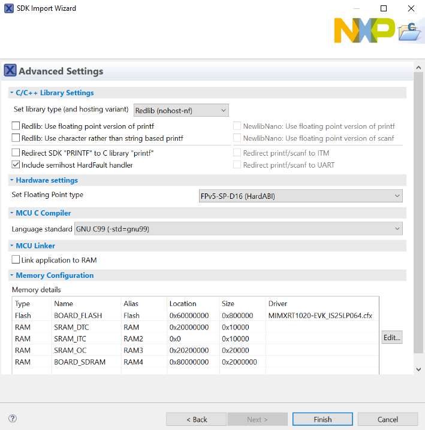
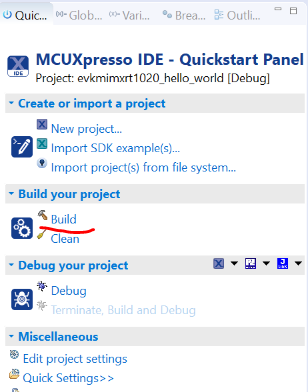
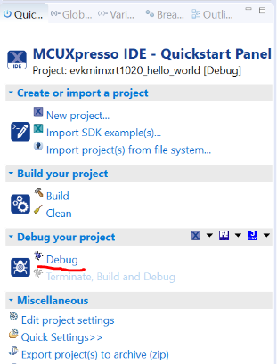
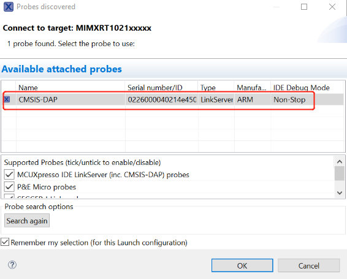
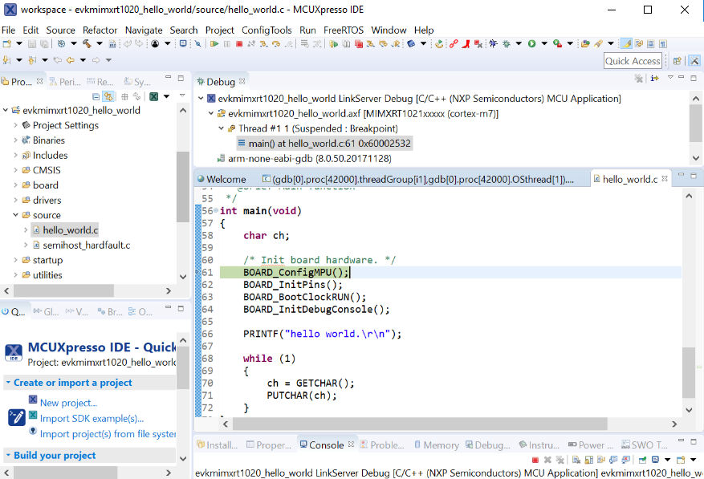

This section describes the steps required to configure MCUXpresso IDE to build, run, and debug example applications.

# :one:Set up Environment

## 1. Install MCUXpresso IDE
1. Download MCUXpresso IDE from [LINK](https://www.nxp.com/design/software/development-software/mcuxpresso-software-and-tools-/mcuxpresso-integrated-development-environment-ide:MCUXpresso-IDE?tab=Design_Tools_Tab). 
2. Open MCUXpresso IDE, select workspace location.

    Every time MCUXpresso IDE launches, it prompts the user to select a workspace location. MCUXpresso IDE is built on top of Eclipse which uses workspace to store information about its current configuration, and in some use cases, source files for the projects are in the workspace. The location of the workspace can be anywhere, but it is recommended that the workspace be located outside of the MCUXpresso SDK tree.

## 2. Copy the board manifest file to root folder
Copy the board manifest file from the `examples/manifests` folder to the root folder of west workspace(mcuxsdk) to explore MCUXpresso IDE build and debug for example application of specified board. 

*Take EVK-MIMXRT1020 as an example, copy EVK-MIMXRT1020_manifest_v3_8.xml file in `manifests` folder to the repository root directory.*

# :two:Build an example application
To build an example application, follow these steps.
1. Drag and drop the repository into the **Installed SDKs** view to install the MCUXpresso SDK. In the window that
appears, click the **OK** button and wait until the import has finished.

    
2. On the **Quickstart Panel**, click **Import SDK example(s)….**

    
3. In the window that appears, expand the **MIMXRT1020** folder and select **MIMXRT1021xxxxx**. Then, select **evkmimxrt1020** and click the **Next** button.

    

4. Expand the demo_apps folder and select hello_world. Then, click the **Next** button.

    

    | :exclamation: NOTE | 
    |:-----------------------------------------:| 
    | If you want to use semihost to print log, first select the Semihost button when importing projects.|

    

5. Ensure the option **Redlib: Use floating point version of printf** is selected if the cases print floating point numbers on the terminal (such as mmcau_examples mmcau_api). Otherwise, there is no need to select it. Click the **Finish** button.

    

6. On the **Quickstart** panel, click **build evkmimxrt1020_demo_apps_hello_world [Debug]**.

    

# :three:Run an example application
For more information on debug probe support in the MCUXpresso IDE, visit community.nxp.com.

To download and run the application, perform these steps:

| :exclamation: NOTE | 
|:-----------------------------------------:| 
| If you are using our evaluation board which uses flashless soc, please make sure that the board is on QSPI_Flash mode before download. (For EVK-MIMXRT1020 in the example, set t SW8: 0010).|

1. On the **Quickstart** panel, click **Debug evkmimxrt1020_demo_apps_hello_world [Debug]**.

    

2. The first time you debug a project, the Debug Emulator Selection Dialog is displayed, showing all supported probes
that are attached to your computer. Select the probe through which you want to debug and click the **OK** button. (For
any future debug sessions, the stored probe selection is automatically used, unless the probe cannot be found.)

    

3. The application is downloaded to the target and automatically runs to main().

    

4. Start the application by clicking the **Resume** button.

    

The hello_world application is now running and a banner is displayed on the MCUXpresso IDE console window. If this is
not the case, check your terminal settings and connections.

